

# Dev_Setup
Setup Development Environment

#Assignment: Setting Up Your Developer Environment

#Objective:
This assignment aims to familiarize you with the tools and configurations necessary to set up an efficient developer environment for software engineering projects. Completing this assignment will give you the skills required to set up a robust and productive workspace conducive to coding, debugging, version control, and collaboration.

#Tasks:

TASK 1. Select Your Operating System (OS):
   Choose an operating system that best suits your preferences and project requirements. Download and Install Windows 11. https://www.microsoft.com/software-download/windows11

   
   --------------- STEPS TO DOWNLOAD AND INSTALL WINDOWS 11 ----------------------

   # STEP 1: Check System Requirements
   
      * Before you begin, ensure your device meets the minimum system requirements for Windows 11:
         Processor: 1 GHz or faster with at least 2 cores on a compatible 64-bit processor or SoC.
         RAM: 4 GB or more.
         Storage: 64 GB or larger storage device.
         System Firmware: UEFI, Secure Boot capable.
         TPM: Trusted Platform Module (TPM) version 2.0.
         Graphics Card: DirectX 12 compatible graphics / WDDM 2.x.
         Display: >9” with HD Resolution (720p).
         Internet connection: Internet connectivity is necessary to perform updates and to download and take advantage of some features.
      
      * Using the PC Health Check Tool to check System Requirements:
      Microsoft provides a tool called the PC Health Check tool, which is designed to help you check if your device is eligible for Windows 11.

         Download the PC Health Check Tool:
            Visit the official Microsoft Windows 11 page. >>https://aka.ms/GetPCHealthCheckApp<<
            Find the section about checking compatibility and download the PC Health Check tool.

         Install and Run the Tool:
            Install the tool by opening the downloaded file and following the installation instructions.
            Launch the PC Health Check tool.
            Click the “Check now” button to see if your device meets the Windows 11 requirements.

         Review the Results:
            The tool will provide a detailed report on your device's compatibility with Windows 11.
            If your device is not compatible, it will specify which requirements are not met.

   # STEP 2: Backup Your Data

      Before installing any new operating system, it’s important to back up your data to avoid any potential loss.
      * Method 1: Using External Storage
         1. Prepare an External Drive:
            - Connect an external hard drive or USB flash drive to your computer.

         2. Select Files to Backup:
            - Open File Explorer and navigate to the files and folders you want to back up.
            - Select the files and folders (e.g., Documents, Pictures, Videos, Desktop) you want to back up.

         3. Copy Files to the External Drive:
            - Right-click the selected files/folders and choose “Copy”.
            - Navigate to the external drive, right-click, and choose “Paste”.
            - Wait for the transfer to complete.

      * Method 2: Using Cloud Storage
         1. **Choose a Cloud Storage Service**:
         - Popular options include Google Drive, OneDrive, Dropbox, and iCloud.

         2. Upload Files to the Cloud:
            - Sign in to your cloud storage account.
            - Use the upload function to select and upload files and folders from your computer.

         3. Sync Files Automatically (optional):
            - Install the cloud storage client on your computer.
            - Sign in and choose the folders you want to sync to the cloud.

      * Method 3: Using Windows Backup and Restore
         1. Open Backup and Restore:
            - Go to Control Panel > System and Security > Backup and Restore (Windows 7).

         2. Set Up Backup:
            - Click “Set up backup” and choose where to save your backup (e.g., external hard drive).

         3. Select Backup Settings:
            - Choose what to back up (let Windows choose or select specific files and folders).
            - Click “Next” and then “Save settings and run backup”.

      * Method 4: Using File History
         1. Open File History:
            - Go to Settings > Update & Security > Backup > Add a drive
            - Select an external drive or network location.

         2. Configure File History:
            - Turn on File History.
            - Choose which folders to back up by selecting “More options”.

      * Method 5: Creating a System Image
         1. Open Backup and Restore**:
            - Go to Control Panel > System and Security > Backup and Restore (Windows 7).

         2. Create a System Image**:
            - Click “Create a system image” in the left pane.
            - Choose a location to save the system image (external drive, DVDs, or network location).
            - Follow the prompts to create the image.

      * Method 6: Using Third-Party Backup Software
         1. Choose Backup Software**:
            - Popular options include Acronis True Image, Macrium Reflect, and EaseUS Todo Backup.

         2. Install and Run the Software**:
            - Download and install your chosen backup software.
            - Follow the software's instructions to back up your data to an external drive or cloud storage.

      * Verifying Your Backup
         1. Check the Backup**:
            - Open the external drive or cloud storage to ensure all your important files are backed up.
            - For system images, use the software's verification tool if available.

         2. Test Restoring a Few Files** (optional):
            - Restore a few files to ensure the backup process was successful.

      By following these steps, you can ensure your data is safely backed up before proceeding with the installation of Windows 11.

   # Step 3: Download Windows 11
      
      * Method 1: Windows Update
         - If your device is eligible, you can upgrade directly via Windows Update.
         - Go to Settings > Update & Security > Windows Update and check for updates.
         - If Windows 11 is available, you will see an option to download and install.

         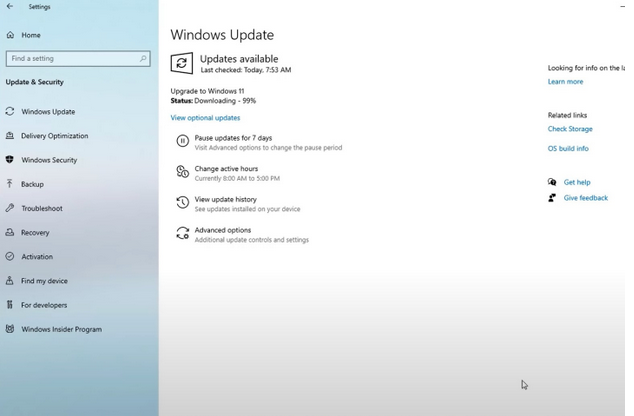

      * Method 2: Windows 11 Installation Assistant
         1. Download the Installation Assistant from the Microsoft Windows 11 download page.
         >>https://www.microsoft.com/en-us/software-download/windows11<<

         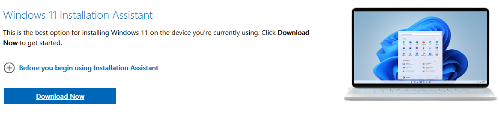

         2. Wait for the tool to download. When complete, launch it. Click Yes when prompted.

         3. In the pop-up box, you'll have to choose Accept and install. From here on out, it will be a three-step process. Wait for Windows 11 to download as part of the first step. It could take a while depending on your connection speed. You might be prompted to agree to the Microsoft terms and service.

         4. In the second step, Windows 11 will verify the integrity of your download. It should take a few seconds.

         5. In the third step, you'll get a prompt about Windows 11 installing in the background. Let it install and wait it out. Depending on the speed of your PC, it could take a while — usually 30 minutes.

         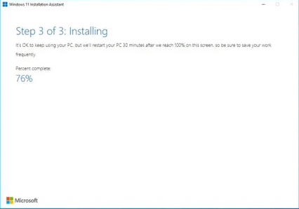

         6. Once the third phase is finished, click the Restart now button. You'll be prompted that you are about to be signed out. Wait while your PC restarts and installs Windows 11. It could take up to 30 minutes or an hour based on the speed and age of your PC and your CPU.

         7. While Windows 11 is installing, you'll see Working on updates on your screen. A percentage will indicate the progress. Your PC will restart a few times, so be patient. Once complete, you'll be taken to the sign-in page, and then the Windows 11 desktop.

         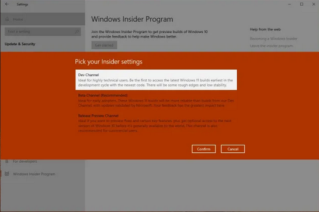

      * Method 3: Create Windows 11 Installation Media
         1. On the same Microsoft download page, select Create Windows 11 Installation Media. Download the Media Creation Tool.

         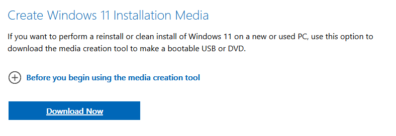

         2. Agree to the terms and choose Accept. Let the Setup tool run, and choose Use the recommended options for this PC. Click Next, and choose USB flash drive.
         
         3. Choose your USB flash drive from the list and then click Next. You'll be prompted and Windows 11 will download to it. Once finished, the installer will switch to Creating Windows 11 Installation media. You'll know when it's finished, as you'll get a prompt that the drive is ready.

         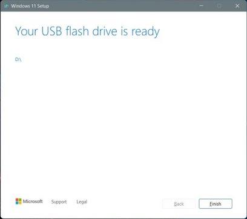

         4. Once your USB drive is ready, close the installer with the Finish button. Keep the USB drive plugged into your PC.

         5. Head back to the Windows 10 settings app, and choose Update & security. Then choose Recovery on the left side. Under Advanced startup, choose the Restart now option.

         6. In the pop-up prompt, choose Use a device. Your USB drive should appear listed. Choose it, and Windows will restart to your USB drive and Windows 11 installer. If you don't see this option, you'll need to head into your BIOS or UEFI to manually boot from the USB drive. Usually, you can do this by pressing F12 on boot as soon as you turn on your PC. Contact your PC maker for more information on this or consult online guides.

         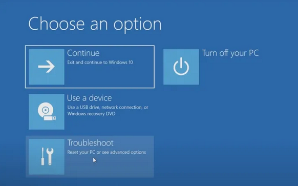

         7. Once in the Windows 11 installer, select a language, and click Next. Pick the version of Windows 11 that matches the version of Windows 10 on your PC. and click Next.

         8. Choose the Custom option and choose the drive to install Windows 11 on. You might have to click the Format button to erase all your files on the drive. When done, select the drive again and click Next.

         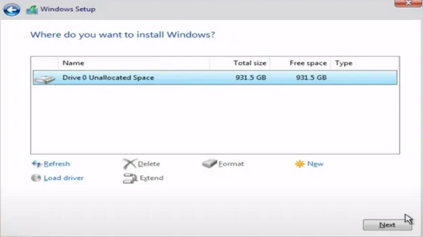

         9. Windows 11 will install to your PC, and you can sit back. You'll then be taken to the out-of-box experience, and will be prompted to set up your PC again.

         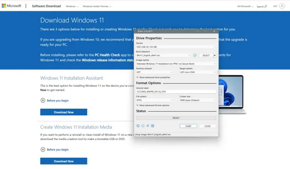

      * Method 4: Windows 11 Disk Image (ISO)
         1. First, visit the Windows 11 download page, and choose the Download Windows 11 Disk Image option. Choose Windows 11 multi-edition ISO from the list, and then the blue Download button. Pick English as your option, followed by the blue Confirm button.

         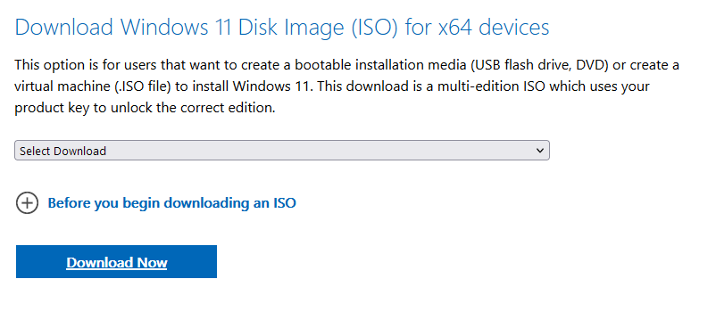

         2. Once the file is downloaded, you'll need to download some extra software to continue with a clean install on Windows 11. We suggest installing Rufus, a great way to create a bootable Windows 11 installation drive.

         3. Download Rufus from the website. Run the file and select Yes. Then, under where it says Device, plug in an empty USB drive and choose it. Make sure the device is bigger than 8GB.

         4. Under Boot selection, choose Disk or ISO image. Then, click the Select button. Navigate to where you saved the Windows 11 ISO file and click Open.

         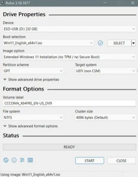

         5. Be sure to choose either Standard Windows 11 installation, or Extended Windows 11 installation. The Standard Windows 11 Installation is best if your PC meets specs. If it doesn't, you can try the extended option to bypass Microsoft's restrictions. Leave everything else as is, and then click the Start button to create the drive.

         6. Wait a while and the USB drive will be ready. Close Rufus when complete, and reboot your PC to install Windows 11 using the steps we mentioned in the previous section.

   # STEP 4: Install Windows 11

      * Method 1: Using Windows Update
      * Method 2: Using Installation Assistant
      * Method 3: Using Bootable USB Drive or DVD
      * Method 4: Using Disk Image (ISO)

   # STEP 5: Post-Installation Setup

      1. Complete the OOBE (Out of Box Experience)
         - Choose your region, keyboard layout, and other preferences.
         - Sign in with your Microsoft account or create a new one.
         - Set up security features, such as Windows Hello, if applicable.

      2. Update Drivers and Install Updates:
         - Go to Settings > Update & Security > Windows Update and check for updates.
         - Ensure all drivers are updated to the latest versions compatible with Windows 11.

      3. Restore Your Data:
         - Restore the data you backed up before the installation.

----------------------------------------------------------------------------------

TASK 2. Install a Text Editor or Integrated Development Environment (IDE):
   Select and install a text editor or IDE suitable for your programming languages and workflow. Download and Install Visual Studio Code. https://code.visualstudio.com/Download

----------- STEPS TO DOWNLOAD AND INSTALL VISUAL STUDIO CODE ---------------------

# STEP 1: Visit the Official Website of the Visual Studio Code using any web browser like Google Chrome, Microsoft Edge, etc.
>>https://code.visualstudio.com/docs/?dv=win<<

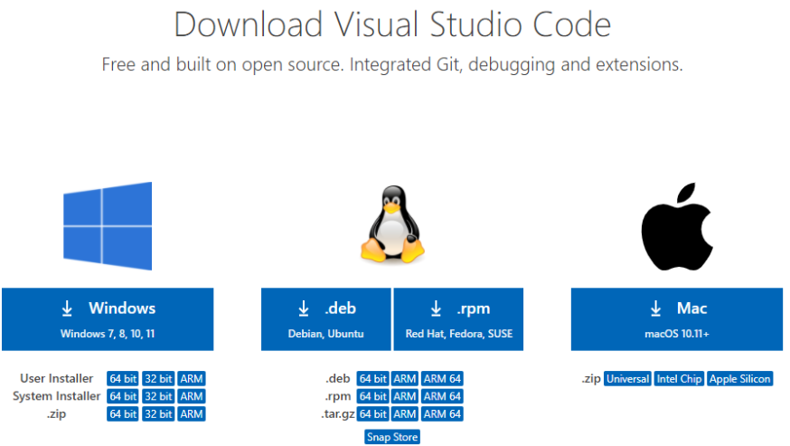

# STEP 2: Press the "Download for Windows" button on the website to start the download of the Visual Studio Code Application.

# STEP 3: When the download finishes, then the Visual Studio Code Icon appears in the downloads folder

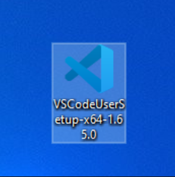

# STEP 4: Click on the Installer icon to start the installation process of the Visual Studio Code.

# Step 5: After the Installer opens, it will ask you to accept the terms and conditions of the Visual Studio Code. Click on 'I accept the agreement' and then click the Next button.

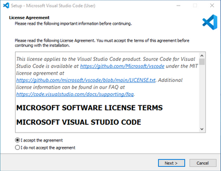

# STEP 6: Choose the location data for running the Visual Studio Code. It will then ask you to brows the location. Then click on the Next button.

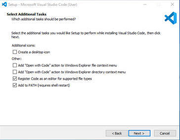

# STEP 7: Then it will ask to begin the installation setup. Click on the Install button

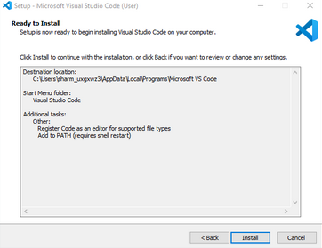

# STEP 8: After clicking on Install, it will take about 1 minute to install the Visual Studio Code on your device.

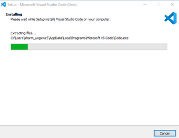

# STEP 9: After the Installation setup for Visual Studio Code is finished, it will show a window like this below. Tick the "Launch Visual Studio Code" checkbox and then click Next.

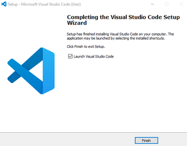

# STEP 10 - After the previous step, the Visual STUDIO Code window opens succesfully. Now you can create a new file in the Visual Studio Code window and choose a language of yours to begin your programming journey!

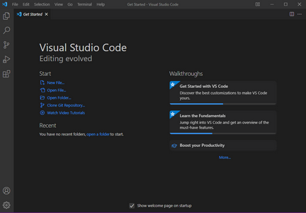

---------------------------------------------------------------------------------

TASK 3. Set Up Version Control System:
   Install Git and configure it on your local machine. Create a GitHub account for hosting your repositories. Initialize a Git repository for your project and make your first commit. https://github.com

----------------- STEPS TO DOWNLOAD AND INSTALL GIT ON WINDOWS ------------------

# STEP 1: Navigate to the Official Git downloads page and click the download link for the latest Git version for Windows:

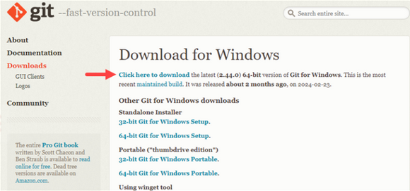

# STEP 2: Double-click the downloaded file to extract and launch the installer.

# STEP 3: Review the GNU General Public License, and when you are ready to install, click Next.

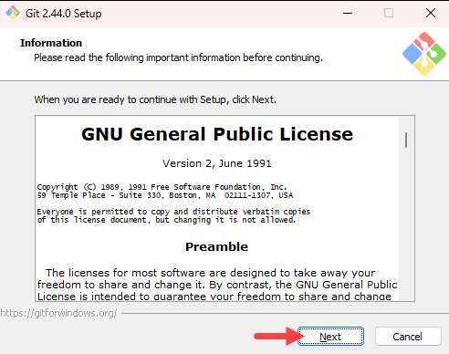

# STEP 4: The installer prompts you for an installation location. Leave the default one unlesss you want to change it, and click Next.

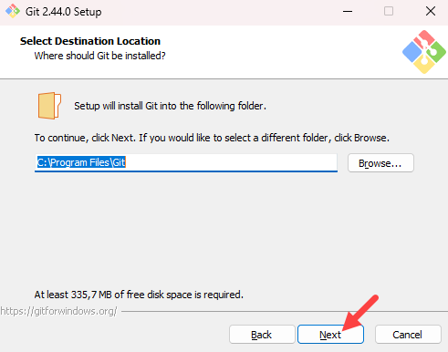

# STEP 5: In the component selection screen, leave the defaults unless you need to change them and click Next.

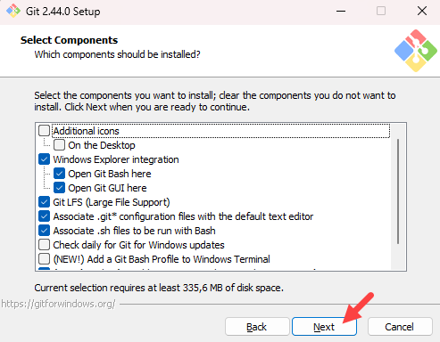

# STEP 6: The Installer offers to create a start menu folder. Click Next to accept and proceed to the next step.

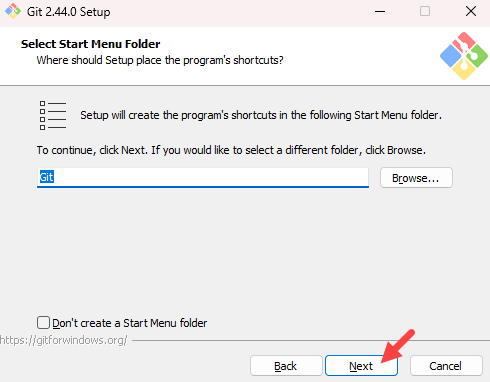

# STEP 7: Select a text editor you want to use with Git. Use the drop-down menu to select Notepad++ (or whichever text editor you prefer) and click Next.

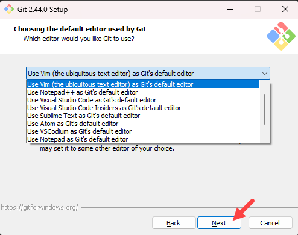

# STEP 8: The next step allows you to choose a different name for your initial branch. The default is master. unless you are working in a team that requires a different name leave the default option and click Next.

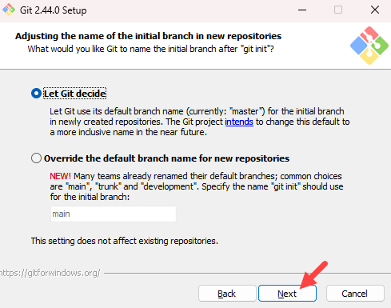

# STEP 9: The next step allows you to change the PATH environment. The PATH is the default set of directories included when you run a command from the command line. Keep the middle (recommended) selection and click Next.

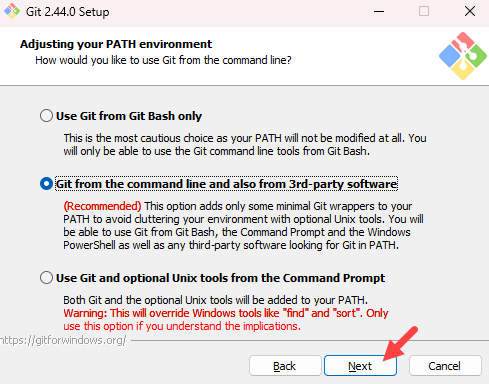

# STEP 10: The installer prompts you to select the SSH client for Git to use. Git already comes with its own SSH client, so if you don't need a specific one, leave the default option and click Next.

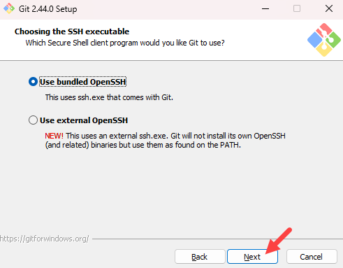

# STEP 11: The next option relates to server certificates. The default option is recommended for most users. If you work in an active Directory environment, you may need to switch to Windows Store certificates. Select your preferred option and click Next.

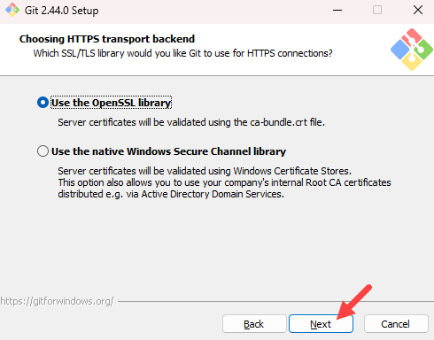

# STEP 12: The following selection configures line-ending conversion, which relates to the way data is formatted. The defaulted selection is recomended for Windows. Click Next to proceed.

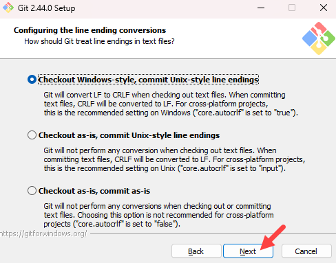

# STEP 13: Choose the terminal emulator you want to use. The default MinTTY is recommended for its features. Click Next to continue.

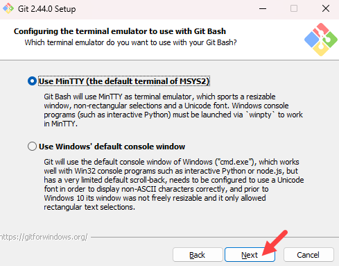

# STEP 14: The next step allows you to choose what the git pull command will do. The default option is recommended unless you specifically need to change its behaviour. Click Next to continue with installation.

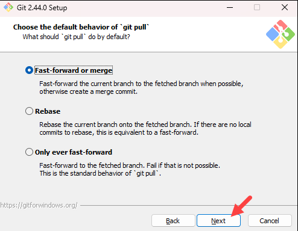

# STEP 15: The next step is to choose which credential helper to use. Git uses credential helpers to fetch or save credentials. The default option is the most stable one. Select your preferred credential manager and click Next.

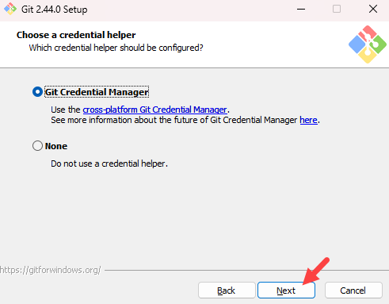

# STEP 16: The next step lets you decide which extra options to enable. If you use symbolic links, which represent shortcuts for the command line, tick the box. Keep file system caching checked and click Next.

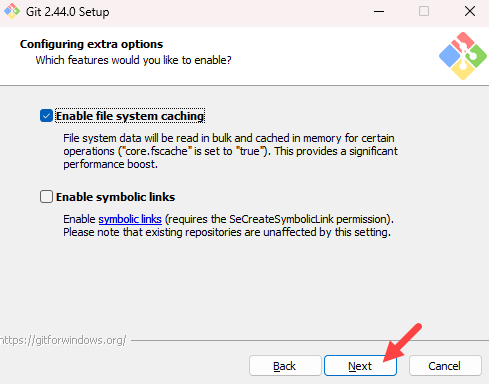

# STEP 17:  Depending on which Git version you are installing, it may offer to install experimental features.For the most stable operation, do not install experimental features and click Install.

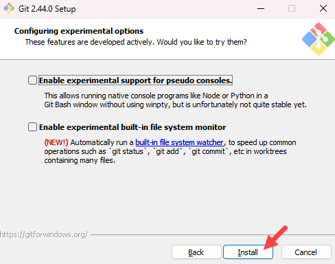

# STEP 18: Once the Installation is complete, tick the boxes to view the Release Notes or launch Git Bash if you want to start using Git right away, and click Finish.

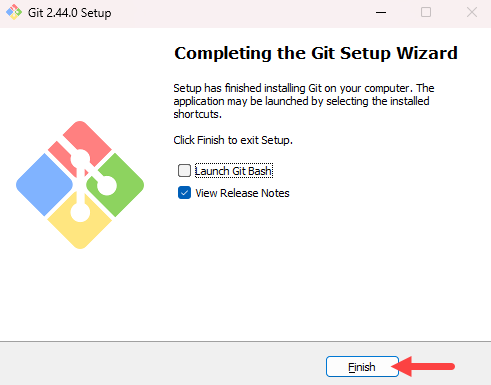

------------------------- CONFIGURING GIT ON WINDOWS -----------------------------

# Configure Identity
- Your identity in Git is your username and email address which Git uses every time you create a commit. To set up your identity, open Git Bash and use the syntax below:

      $ git config --global user.name "[username]"

- Replace [username] with the actual username you will use. If you have a GitHub account, you can use that username and email. 

      $ git config --global user.email [email]

- Replace [email] with the email you want to use.

------------------ CREATING YOUR FIRST GIT REPOSITORY ---------------------------

# Check Git Version
- To check which Git version is installed on your system, open the PowerShell and run the following command:

      $ git --version

      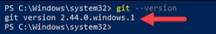

- The output shows which Git versionis installed on the system.

# Create and Initialize Project Directory
   1. Open Git Bash or a Windows PowerShell interface and use the syntax below to create a new test directory (folder):

         $ mkdir [directory_name]
   
   2. Change your location to the newly created directory with the cd command:

         $ cd [directory_name]
   
   3. Initialize the directory as Git repository by running:

         $ git init

# Clone GitHub Repository
   1. In a web browser, navigate to your repository on GitHub.

   2. Click the Code button and select the HTTPS or SSH option, depending on how you want to secure your connection. For this tutorial, we will use HTTPS. Copy the URL for cloning the repository.

   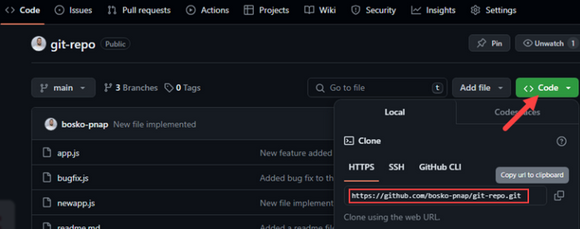

   3. Open Git Bash or Windows PowerShell and use the syntax below to clone the repository:

         $ git clone [repository_url]
   
   Replace [repository_url] with the URL you copied on GitHub. For example:

   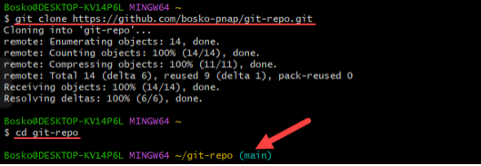

# Push Local Files to Remote Repository
   1. Open Git Bash and create a new file with the touch command:

         $ touch text.txt

   2. Add your new file to the tracking index:

         $ git add text.txt

      If you have created multiple files, you can track all files by running:

         $ git add .
   
   3. Run the following command to make sure the text.txt file has been added:

         $ git status

   4. Next, commit the changes using the syntax below:

         $ git commit -m "[commit_message]"
   
      The -m option allows you to specify a commit message within the commit command. If you omit the -m option, Git opens the default text editor in which you can write the commit message.

   5. Finally, push the changes to the remote GitHub repository:

         $ git push [remote_repository]
   
      Replace [remote_repository] with the name of your remote repo. For example:

      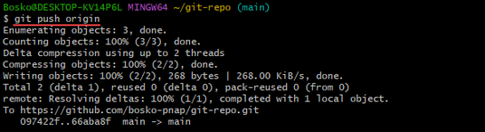

---------------------------------------------------------------------------------

TASK 4. Install Necessary Programming Languages and Runtimes:
  Instal Python from http://wwww.python.org programming language required for your project and install their respective compilers, interpreters, or runtimes. Ensure you have the necessary tools to build and execute your code.

-------------------------- STEPS TO INSTALL PYTHON -----------------------------

# STEP 1: Select Python Version
We recommend Python 3, as Python 2 reached its end of life in 2020. Download Python 2 only if you work with legacy scripts and older projects. Also, choose a stable release over the newest since the newest release may have bugs and issues.

# STEP 2: Download Python Executable Installer 
Start by downloading the Python executable installer for Windows:
1. Open a web browser and navigate to the Downloads for Windows section of the official Python website. >>https://www.python.org/downloads/windows/<<

2. Locate the desired Python version. 

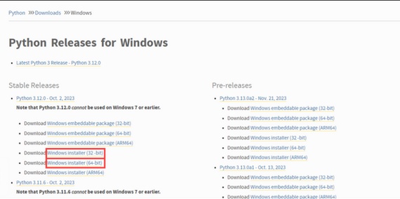

3. Click the link to download the file. Choose either the Windows 32-bit or 64-bit installer.

The download is approximately 25MB.

# STEP 3: Run Executable Installer

The steps below guide you through the installation process:

1. Run the downloaded Python Installer.

2. The installation window shows two checkboxes:

    Admin privileges. The parameter controls whether to install Python for the current or all system users. This option allows you to change the installation folder for Python.
    Add Python to PATH. The second option places the executable in the PATH variable after installation. You can also add Python to the PATH environment variable manually later.

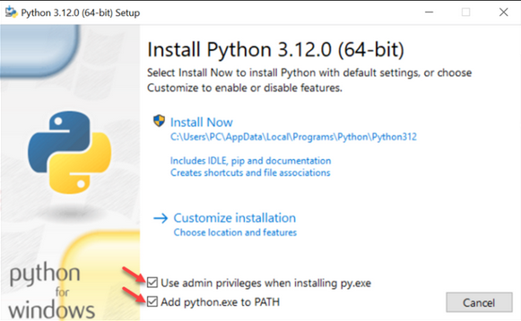

For the most straightforward installation, we recommend ticking both checkboxes.

3. Select the Install Now option for the recommended installation (in that case, skip the next two steps).

To adjust the default installation options, choose Customize installation instead and proceed to the following step.

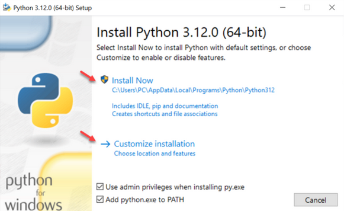

The default installation installs Python to C:\Users\[user]\AppData\Local\Programs\Python\Python[version] for the current user. It includes IDLE (the default Python editor), the PIP package manager, and additional documentation. The installer also creates necessary shortcuts and file associations.

Customizing the installation allows changing these installation options and parameters.

4. Choose the optional installation features. Python works without these features, but adding them improves the program's usability.

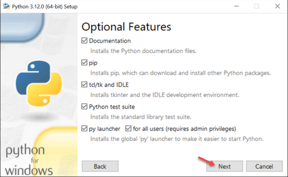

Click Next to proceed to the Advanced Options screen.

5. The second part of customizing the installation includes advanced options.

Choose whether to install Python for all users. The option changes the install location to C:\Program Files\Python[version]. If selecting the location manually, a common choice is C:\Python[version] because it avoids spaces in the path, and all users can access it. Due to administrative rights, both paths may cause issues during package installation.

Other advanced options include creating shortcuts, file associations, and adding Python to PATH.

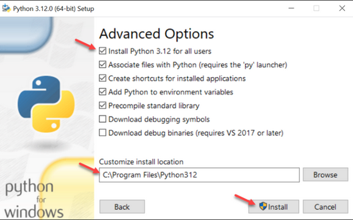

After picking the appropriate options, click Install to start the installation.

6. Select whether to disable the path length limit. Choosing this option will allow Python to bypass the 260-character MAX_PATH limit. 

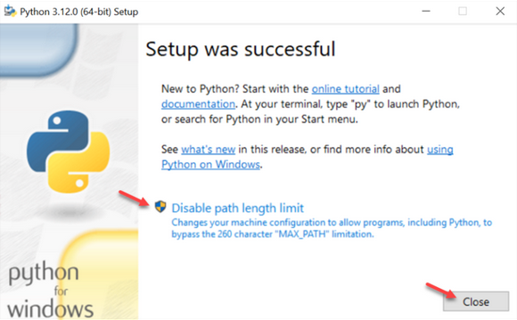

The option will not affect any other system settings, and disabling it resolves potential name-length issues. We recommend selecting the option and closing the setup.

# STEP 4: Add Python to Path (Optional)

If the Python installer does not include the Add Python to PATH checkbox or you have not selected that option, continue in this step. Otherwise, skip to the next step.

Adding the Python path to the PATH variable alleviates the need to use the full path to access the Python program in the command line. It instructs Windows to review all the folders added to the PATH environment variable and to look for the python.exe program in those folders.

To add Python to PATH, do the following:

1. In the Start menu, search for Environment Variables and press Enter.

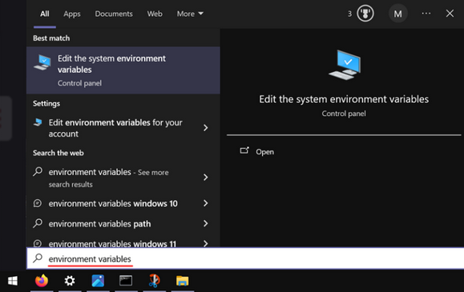

2. Click Environment Variables to open the overview screen.
System properties environment variables button.

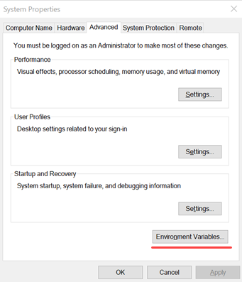

3. Double-click Path on the list to edit it.

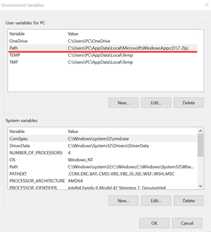

Alternatively, select the variable and click the Edit button.

4. Double-click the first empty field and paste the Python installation folder path.

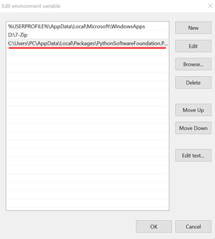

Alternatively, click the New button instead and paste the path.

5. Click OK to save the changes. If the command prompt is open, restart it for the following step.

# STEP 5: Verify Python Was Installed on Windows

The first way to verify that Python was installed successfully is through the command line. Open the command prompt and run the following command:

      $ python --version

The output shows the installed Python version.

The second way is to use the GUI to verify the Python installation. Follow the steps below to run the Python interpreter or IDLE:

1. Navigate to the directory where Python was installed on the system.

2. Double-click python.exe (the Python interpreter) or IDLE.

3. The interpreter opens the command prompt and shows the following window:

Running IDLE opens Python's built-in IDE:

In both cases, the installed Python version shows on the screen, and the editor is ready for use.

---------------------------------------------------------------------------------

TASK 5. Install Package Managers:
   If applicable, install package managers like pip (Python).

------------------- INSTALL PIP ON WINDOWS USING ENSUREPIP ----------------------

# STEP 1: Verify PIP Was Installed

To verify whether PIP was installed, enter the following command in the command prompt:

      $ pip --version

If it was installed successfully, you should see the PIP version number, the executable path, and the Python version:

PIP has not been installed yet if you get the following output:

      'pip' is not recognized as an internal or external command,
      Operable program or batch file.

If an older version of Python is installed or the PIP installation option is disabled during installation, PIP will not be available. To install PIP, see our article How to Install PIP on Windows.

# STEP 2: Install PIP using ensurepip
This uses Python to install PIP without downloading or running any scripts. Enter the following command in the command prompt:

      $ python -m ensurepip --upgrade

Wait for the installation to complete. Check that PIP is installed correctly with the following command:

      $ pip --version

# STEP 3: Upgrading PIP for Python on Windows
New versions of PIP are released occasionally. These versions may improve the functionality or be obligatory for security purposes.

To upgrade PIP on Windows, enter the following in the command prompt:

      $ pip install --upgrade pip

This command uninstalls the previous version and then installs the most current version of PIP.

# STEP 4: Downgrading PIP Version

Downgrading may be necessary if a new version of PIP starts performing undesirably. To downgrade PIP to a prior version, specify the version you want.

To downgrade PIP, use the following syntax:

      $ python -m pip install pip==[version_number]

For example, to downgrade to version 18.1, run:

      $ python -m pip install pip==18.1

---------------------------------------------------------------------------------

TASK 6. Configure a Database (MySQL):
   Download and install MySQL database. https://dev.mysql.com/downloads/windows/installer/5.7.html

----------------- HOW TO DOWNLOAD INSTALL AND SETUP MYSQL ----------------------

The simplest and recommended method is to download MySQL Installer for Windows from https://dev.mysql.com/downloads/installer/ and execute it.

Select mysql-installer-web-community-8.0.23.msi if you have good internet connection, otherwise choose mysql-installer-community-8.0.23.msi.

# Install MySQL
fter downloading, unzip it, and double click the MSI installer .exe file.

Then follow the steps below:

   1. "Choosing a Setup Type" screen: Choose "Full" setup type. This installs all MySQL products and features. Then click the "Next" button to continue.

   2. "Check Requirements" screen: The installer checks if your pc has the requirements needed. If there is some failing requirements, click on each item to try to resolve them by clicking on the Execute button that will install all requirements automatically. Click "Next".

   3. "Installation" screen: See what products that will be installed. Click "Execute" to download and install the Products. After finishing the installation, click "Next".

   4. "Product Configuration" screen: See what products that will be configured. Click the "MySQL Server 8.0.23" option to configure the MySQL Server. Click the "Next" button. Choose the "Standalone MySQL Server/Classic MySQL Replication" option and click on the "Next" button. In page  "Type and Networking" set Config Type to "Development Computer" and "Connectivity" to "TCP/IP" and "Port" to "3006". Then, click the "Next" button.

   5. "Authentication Method" screen: Choose "Use Strong Password Encryption for Authentication". Click "Next".

   6. "Accounts and Roles" screen: Set a password for the root account. Click "Next".

   7. "Windows Service" screen: Here, you configure the Windows Service to start the server. Keep the default setup, then click "Next".

   8. "Apply Configuration" screen: Click the "Execute" button to apply the Server configuration. After finishing, click the "Finish" button.

   9. "Product Configuration" screen: See that the Product Configuration is completed. Keep the default setting and click on the "Next" and "Finish" button to complete the MySQL package installation.

   10. In the next screen, you can choose to configure the Router. Click on "Next", "Finish" and then click the "Next" button.

   11. "Connect To Server" screen: Type in the root password (from step 6). Click the "Check" button to check if the connection is successful or not. Click on the "Next" button.

   12. "Apply Configuration" screen: Select the options and click the "Execute" button. After finishing, click the "Finish" button.

   13. "Installation Complete" screen: The installation is complete. Click the "Finish" button.

# Verify MySQL Installation

Open the MySQL Command Line Client from cmd.

You should see a mysql> prompt. If you have set any password, write your password here.

Now, you are connected to the MySQL server, and you can execute all the SQL command at mysql> prompt as follows:

For example: Check the already created databases with show databases command:

      $ show databases;

---------------------------------------------------------------------------------

7. Set Up Development Environments and Virtualization (Optional):
   Consider using virtualization tools like Docker or virtual machines to isolate project dependencies and ensure consistent environments across different machines.

8. Explore Extensions and Plugins:
   Explore available extensions, plugins, and add-ons for your chosen text editor or IDE to enhance functionality, such as syntax highlighting, linting, code formatting, and version control integration.

--------------- ESSENTIAL EXTENSIONS FOR VISUAL STUDIO CODE ----------------------
* .NET Install Tool:
      - This extension installs and manages different versions of the .NET SDK and Runtime.
* Code Runner:
      - Run C, C++, Java, JS, PHP, Python, Perl, Ruby, Go, Lua, Groovy, PowerShell, CMD, BASH, F#, C#, VBScript, TypeScript, CoffeeScript, Scala, Swift, Julia, Crystal, OCaml, R, AppleScript, Elixir, VB.NET, Clojure, Haxe, Obj-C, Rust, Racket, Scheme, AutoHotkey, AutoIt, Kotlin, Dart, Pascal, Haskell, Nim,
* Dart:
      - Dart Language support and debugger for Visual Studio Code
* Data Workspace:
      - Additional common functionality for database projects
* Docker:
      - Makes it easy to create manage and debug containerized aplpications.
* Flutter:
      - Flutter support and debugger for Visual Studio Code.
* Gradle for Java:
      - Manages Gradle Projects, run Gradle tasks and provide better Gradle file authoring experience in VS Code
* PHP Debug:
      - Debug support for PHP with Xdebug.
* PHP Intelephense:
      - PHP code intelligence for Visual Studio Code
* Prettier 0 Code Formatter:
      - Code formatter using prettier
* Pylance:
      - A performant, feature-rich language server for Python in VS Code.
* Python:
      - Python language support with extension access points for IntelliSense (Pylance), Debugging (Python Debugger), linting, formatting, refactoring, unit tests, and more.
* Python Debugger:
      - Python extension Debugger using debugpy.
* SQL Bindings:
      - Enables users to develop and publish Azure Functions with Azure SQL bindings
* SQL Databse Projects:
      - Enables users to develop and publish database schemas for MSSQL Databases
* SQL Server (mssql):
      - Develop Microsoft SQL Server, Azure SQL Database and SQL Data Warehouse everywhere.
* SQLite Viewer:
      - SQLite Viewer for VSCode
* Tailwind CSS IntelliSense
      - Intelligent Tailwind CSS tooling for VS Code
* GitHub Copilot:
      - Your AI pair programmer
* SQL Tools
      - Connecting users to many of the most commonly used databases. Welcome to database management done right.

---------------------------------------------------------------------------------

9. Document Your Setup:
    Create a comprehensive document outlining the steps you've taken to set up your developer environment. Include any configurations, customizations, or troubleshooting steps encountered during the process. 

#Deliverables:
- Document detailing the setup process with step-by-step instructions and screenshots where necessary.
- A GitHub repository containing a sample project initialized with Git and any necessary configuration files (e.g., .gitignore).
- A reflection on the challenges faced during setup and strategies employed to overcome them.

#Submission:
Submit your document and GitHub repository link through the designated platform or email to the instructor by the specified deadline.

#Evaluation Criteria:**
- Completeness and accuracy of setup documentation.
- Effectiveness of version control implementation.
- Appropriateness of tools selected for the project requirements.
- Clarity of reflection on challenges and solutions encountered.
- Adherence to submission guidelines and deadlines.

Note: Feel free to reach out for clarification or assistance with any aspect of the assignment.
